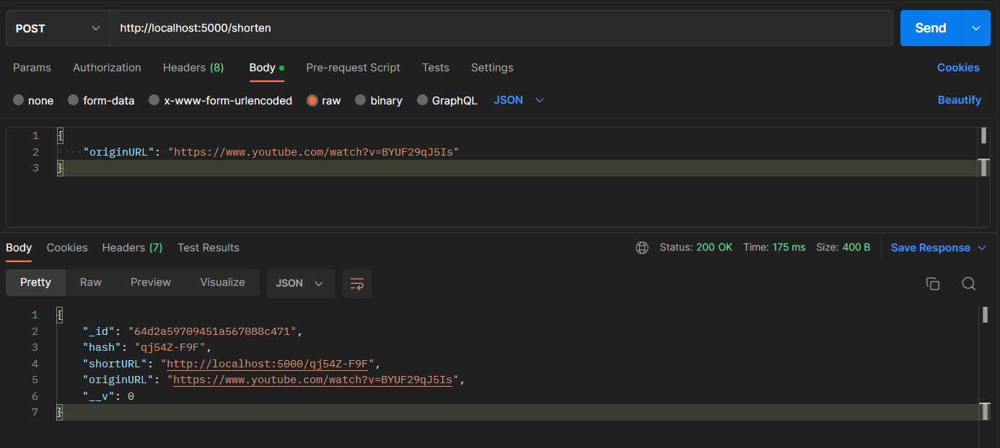

# URL Shortner


[API SHORTNER](https://github.com/Matheus1714/url-shortner) is a project that is a solution as the challenge of the [Bootcamp Eduzz Fullstack Developer](https://www.dio.me/bootcamp/eduzz-fullstack-developer) program offered by DIO ([dio.me](https://web.dio.me/)). It is a dynamic API harnesses the power of [TypeScript](https://www.typescriptlang.org/) and [Node.js](https://nodejs.org/) to provide a solution for aspiring fullstack developers.

## Technologies

The main technologies in this project are:

* [TypeScript](https://www.typescriptlang.org/)
* [Node.js](https://nodejs.org/)
* [MongoDB](https://www.mongodb.com/)

## Dependencies

The dependencies used are:

```json
"dependencies": {
    "@hasezoey/typegoose": "^5.9.2",
    "@typescript-eslint/eslint-plugin": "^4.0.1",
    "@typescript-eslint/parser": "^4.0.1",
    "cors": "^2.8.5",
    "eslint": "^7.8.1",
    "express": "^4.17.1",
    "mongoose": "^5.10.6",
    "nodemon": "^2.0.4",
    "shortid": "^2.2.15",
    "tslint": "^6.1.3",
    "typescript": "^4.0.2"
},
"devDependencies": {
    "@types/express": "^4.17.8",
    "@types/mongoose": "^5.7.36",
    "@types/shortid": "0.0.29"
}
```

## Database

Before run this project, create a file `.env` and copy the information from `.env.example`. Config the variable `MONGO_CONNECTION` based your cluster create from [MongoDB](https://www.mongodb.com/).

```env
MONGO_CONNECTION="..."
API_URL="http://localhost:5000"
```

## Start Project

### Install Dependencies

```shell
npm install
```

### Build Typescript

```shell
npm run dev
```

### Build Typescript

```shell
npm run build:watch
```

### Test API

To test the API, POST to the [/shorten](http://localhost:5000/shorten) route using the terminal or [Postman](https://www.postman.com/).

